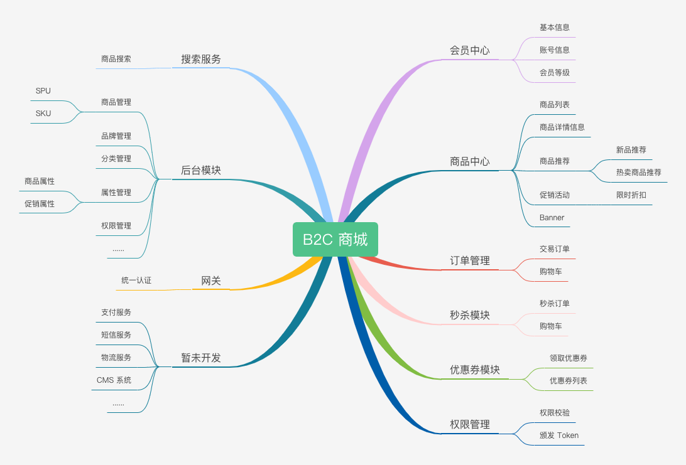

# 商城实战项目

## 概述

基于微服务的思想，构建在 B2C 电商场景下的、前后端分离的商城项目。

目前项目整体功能比较简陋，项目划分比较简单，后续有时间会继续优化。

### 功能

目前，商城的整体功能如下图所示：

## 技术

### 架构图

TODO 

### 项目结构

| 模块 | 名称  |
| ------ | ------ |
| mall-admin | 管理后台 |
| mall-

### 技术栈

| 框架 | 说明  | 版本 |
| ------ | ------ | ------ |
| [Spring Boot](https://spring.io/projects/spring-boot) | Java 应用开发框架 | 2.1.17 |
| [MySQL](https://www.mysql.com/cn/) | 数据库 | 5.7 |
| [Druid](https://github.com/alibaba/druid) | JDBC 连接池、监控组件 | 1.1.17 |
| [MyBatis](http://www.mybatis.org/mybatis-3/zh/index.html) | 数据持久层框架 | 3.5.1 |
| [MyBatis-Plus](https://mp.baomidou.com/) | MyBatis 增强工具包 | 暂未引入 |
| [Redis](https://redis.io/) | kwy-value 数据库 | 5.0.3 |
| [Elasticsearch](https://www.elastic.co/cn/) | 分布式搜索引擎 | 7.6.1 |
| [RocketMQ](https://rocketmq.apache.org/) | 消息中间件 | 4.7.1 |
| [spring-cloud-gateway](https://spring.io/projects/spring-cloud-gateway) | 网关 | 2.3.2 |
| [springfox-swagger2](https://github.com/springfox/springfox/tree/master/springfox-swagger2) | API 文档 | 2.7.0 |

未来考虑引入
* [ ] 服务注册 / 服务发现 / 配置中心 Nacos
* [ ] 服务流控 Sentinel
* [ ] 分布式事务 Seta
* [ ] 日志中心 ELK
* [ ] 监控告警 Prometheus
* [ ] 监控可视化 Grafana
* [ ] 调用链跟踪 SkyWalking
* [ ] 容器化部署 Docker